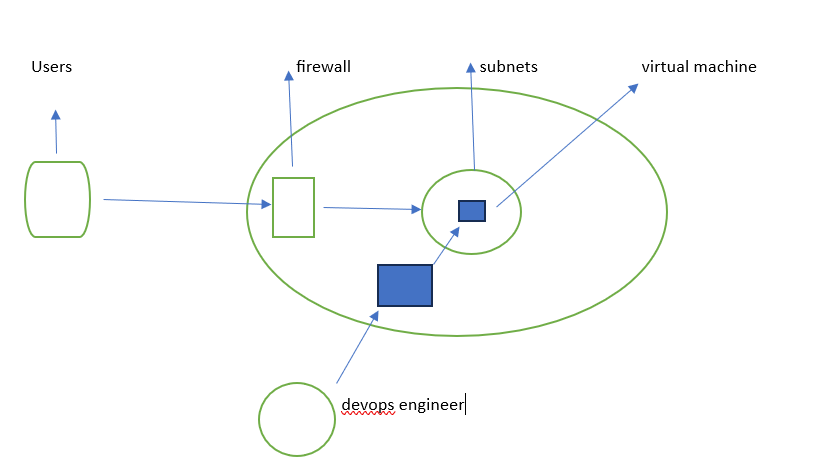
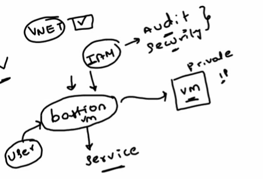
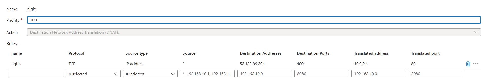

Initially planned to cover Azure interview questions for Virtual Machines and Networking.

Swapped Day-7 with Day-8 to conduct a practical session before addressing scenario-based interview questions.

### High-Level Goals:

Create and configure a Virtual Network (VNet).

Set up a Firewall and Network Security Group (NSG).

Deploy a Virtual Machine (VM) in a subnet.

Host a static HTML page on the VM using Nginx.

Demonstrate Bastion connectivity for private VMs.

Key Concepts Covered:

Importance of firewalls for application security.

Configuration of subnet routing and access controls.

Use of Bastion for secure SSH/RDP connections to private VMs.

Step-by-Step Implementation

1. Resource Group Creation:

A Resource Group (named "project") is created to organize all related resources.

Important note: Delete the Resource Group after the demo to avoid unnecessary charges.

2. Virtual Network (VNet) Setup:

Create a VNet within the Resource Group with the following configurations:

Enable Bastion for secure connections.

Create multiple subnets:

Web Application Subnet.

Bastion Subnet (created automatically by Azure).

Firewall Subnet (created automatically).

Assign CIDR ranges for subnets.

3. Firewall Configuration:

Enable a Firewall with a basic or standard tier.

Define firewall policies to:

Allow specific IP addresses (e.g., the developer’s laptop) to access the VM.

Block unauthorized access attempts.

Utilize Denial of Service (DoS) prevention mechanisms if needed.

4. Virtual Machine Deployment:

Deploy an Ubuntu-based VM in the Web Application Subnet.

Disable public IP to ensure the VM remains private.

Configure NSG to allow SSH (Port 22) and later HTTP (Port 80) for web access.

5. Hosting a Static HTML Page:

Install Nginx using the following commands:
~~~
sudo apt update
sudo apt install nginx
~~~
Place the HTML page in the /var/www/html/ directory.

6. Bastion Connectivity:

Use Bastion for secure SSH access to the private VM.

Advantages:

Acts as a proxy between developers and private resources.

Simplifies access control.

7. Firewall NAT Rules:

Configure a Destination NAT (DNAT) rule:

Source IP: Developer’s laptop.

Destination IP: Firewall public IP.

Forward traffic to VM’s private IP on Port 80.

Example rule name: "Firewall Nginx Rule."

Diagram (Conceptual Overview)

Architecture:

VNet with Subnets:

Firewall Subnet.

Bastion Subnet.

Web Application Subnet.

VM with private IP hosting Nginx.

Bastion used for SSH connections.

Firewall manages traffic routing and security.

Traffic Flow:
~~~
User ➔ Firewall Public IP ➔ Firewall Rule ➔ VM Private IP (via NAT).
~~~
### Key Takeaways

This practical session emphasizes the importance of configuring Azure networking components to ensure security and efficient traffic management.

Key tools like Bastion and Firewall enhance the overall security posture of the environment.

