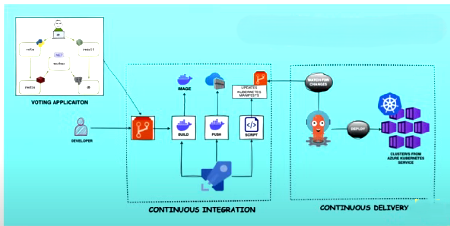

### Aim
implement the complete CICD pipeline in azure devops by using the **docker examples: https://github.com/dockersamples/example-voting-app**

### steps
1) import the repostory
2) create a pipeline --> to build and push the image to container register 
3) automation script --> to update the tags
4) deploy the application on kubernetes and manage the container using argocd

### import the repostory
azure devops repos --> import and enter the githib URL --> import it
### create a pipeline
here three microservices are there vote, result, worker --> for this need create three images (to build and push the image to container register)
 **example:pipeline given in the vote pipeline other two also simmillar** --> it is microsoft hosted pipeline (meaning: azure spin the infra at the time for pipeline running once complete it destroy the infra)

**Self-hosted**: 
1) create a virtual machine and configure the virtual machine as host (once vm created --> azure devops --> organization settings-->agent pool-->create it if neccssary--> agent--> new agent --> run the steps to connect the agant for CI  proccess(get config file and run it ))
~~~
pool:
 name: 'azureagent'
~~~
### automation script
~~~
#!/bin/bash

set -x

# Set the repository URL
REPO_URL="https://<ACCESS-TOKEN>@dev.azure.com/<AZURE-DEVOPS-ORG-NAME>/voting-app/_git/voting-app"

# Clone the git repository into the /tmp directory
git clone "$REPO_URL" /tmp/temp_repo

# Navigate into the cloned repository directory
cd /tmp/temp_repo

# Make changes to the Kubernetes manifest file(s)
# For example, let's say you want to change the image tag in a deployment.yaml file
sed -i "s|image:.*|image: <ACR-REGISTRY-NAME>/$2:$3|g" k8s-specifications/$1-deployment.yaml

# Add the modified files
git add .

# Commit the changes
git commit -m "Update Kubernetes manifest"

# Push the changes back to the repository
git push

# Cleanup: remove the temporary directory
rm -rf /tmp/temp_repo
~~~

### before this create AZURE CONTAINER REGISTOR and AZURE KUBERNETES SERIVES
--> push the three images to ACR
**example steps**
~~~
stages:
- stage: Build
  displayName: Build 
  jobs:
  - job: Build
    displayName: Build
    steps:
    - task: Docker@2
      displayName: Build an image
      inputs:
        containerRegistry: '$(dockerRegistryServiceConnection)'
        repository: '$(imageRepository)'
        command: 'build'
        Dockerfile: 'vote/Dockerfile'
        tags: '$(tag)'
- stage: Push
  displayName: Push 
  jobs:
  - job: Push
    displayName: Push
    steps:
    - task: Docker@2
      displayName: Build an image
      inputs:
        containerRegistry: '$(dockerRegistryServiceConnection)'
        repository: '$(imageRepository)'
        command: 'push'
        tags: '$(tag)'
- stage: Update
  displayName: Update 
  jobs:
  - job: Update
    displayName: Update
    steps:
    - task: ShellScript@2
      inputs:
        scriptPath: 'scripts/updateK8sManifests.sh'
        args: 'vote $(imageRepository) $(tag)'
~~~
## for AKS
create a AKS custer with simple infra and click on public ip too

To access an Azure Kubernetes Service (AKS) cluster from your laptop
### 1. Install Required Tools
Ensure the following tools are installed on your laptop:

Azure CLI: Install Azure CLI
kubectl: Install kubectl
### 2. Authenticate with Azure
Log in to your Azure account:
~~~
az login
~~~
If you have multiple subscriptions, set the desired subscription:
~~~
az account set --subscription "<Subscription-ID>"
~~~
### 3. Get AKS Cluster Credentials
Use the az aks get-credentials command to configure kubectl to access your AKS cluster:
~~~
az aks get-credentials --resource-group <Resource-Group-Name> --name <AKS-Cluster-Name>
~~~
4. Verify Connectivity to the Cluster
~~~
kubectl get nodes
~~~

### install argocd and argocd CLI
~~~
kubectl create namespace argocd
kubectl apply -n argocd -f https://raw.githubusercontent.com/argoproj/argo-cd/stable/manifests/install.yaml
~~~
### change argocd serices from custerIP to NodePort
~~~
kubectl edit svc argocd-server -n argocd
~~~
get password
~~~
kubectl get secret argocd-initial-admin-secret -n argocd -o jsonpath="{.data.password}" | base64 --decode
~~~
### if need to use argocd cli for addiing custers and for information etc
~~~
argocd login <ARGOCD_SERVER>
~~~
## agocd configuration 
1) configure repostory (argocd --> setting --> repostory--> create repository connection)
   --> use the personal token from azure devops and add the repo URL  (if it is private repo)
2) configure the custer
(application and create the application)

if any changes make it automatically detect and run it 

# Command to create ACR ImagePullSecret

need to implement both --> create a secret and use the secret
### create a secret
```
kubectl create secret docker-registry <secret-name> \
    --namespace <namespace> \
    --docker-server=<container-registry-name>.azurecr.io \
    --docker-username=<service-principal-ID> \
    --docker-password=<service-principal-password>
```
### se the secret --> in deployment.yaml 
~~~
imagePullSecrets:
 - name: acr-secret  
~~~


